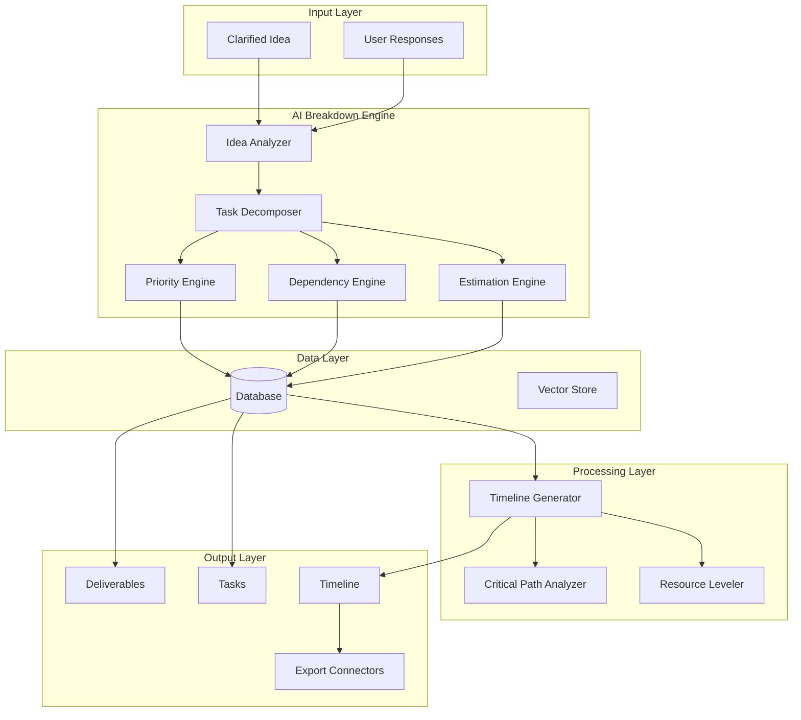

# Automatic Breakdown Engine Architecture - Phase 1

## Overview

The Automatic Breakdown Engine (ABE) is the core component of Phase 1 that transforms clarified ideas into structured deliverables and tasks with timeline generation capabilities.

## System Architecture



## Core Components

### 1. AI Breakdown Engine

#### Idea Analyzer

- **Purpose**: Analyze clarified ideas and extract key components
- **Input**: Refined idea with user responses
- **Output**: Structured idea components, scope, complexity assessment
- **Key Features**:
  - Natural language processing for scope identification
  - Complexity scoring algorithm
  - Domain-specific pattern recognition
  - Risk factor identification

#### Task Decomposer

- **Purpose**: Break down deliverables into atomic tasks
- **Input**: Deliverable definitions and scope
- **Output**: Hierarchical task structure
- **Key Features**:
  - Hierarchical task breakdown
  - Task granularity optimization
  - Work package generation
  - Standardized task templates

#### Priority Engine

- **Purpose**: Calculate priorities for deliverables and tasks
- **Input**: Business value, dependencies, constraints
- **Output**: Priority scores and rankings
- **Key Features**:
  - MoSCoW method implementation
  - Value vs effort matrix
  - Business impact scoring
  - Stakeholder weight consideration

#### Dependency Engine

- **Purpose**: Identify and manage task dependencies
- **Input**: Task definitions and relationships
- **Output**: Dependency graph and constraints
- **Key Features**:
  - Finish-to-start, start-to-start dependencies
  - Circular dependency detection
  - Critical path identification
  - Dependency visualization

#### Estimation Engine

- **Purpose**: Generate time and resource estimates
- **Input**: Task complexity, historical data, team capacity
- **Output**: Time estimates and confidence scores
- **Key Features**:
  - Three-point estimation (PERT)
  - Machine learning-based estimation
  - Team velocity consideration
  - Risk-adjusted estimates

### 2. Data Model Extensions

#### New Tables

```sql
-- Task Dependencies
CREATE TABLE task_dependencies (
    id UUID DEFAULT uuid_generate_v4() PRIMARY KEY,
    predecessor_task_id UUID REFERENCES tasks(id),
    successor_task_id UUID REFERENCES tasks(id),
    dependency_type TEXT DEFAULT 'finish_to_start'
        CHECK (dependency_type IN ('finish_to_start', 'start_to_start', 'finish_to_finish', 'start_to_finish')),
    lag_days INTEGER DEFAULT 0,
    created_at TIMESTAMP WITH TIME ZONE DEFAULT NOW()
);

-- Milestones
CREATE TABLE milestones (
    id UUID DEFAULT uuid_generate_v4() PRIMARY KEY,
    idea_id UUID REFERENCES ideas(id) ON DELETE CASCADE,
    title TEXT NOT NULL,
    description TEXT,
    target_date DATE,
    status TEXT DEFAULT 'pending' CHECK (status IN ('pending', 'completed', 'delayed')),
    created_at TIMESTAMP WITH TIME ZONE DEFAULT NOW()
);

-- Task Assignments
CREATE TABLE task_assignments (
    id UUID DEFAULT uuid_generate_v4() PRIMARY KEY,
    task_id UUID REFERENCES tasks(id) ON DELETE CASCADE,
    user_id UUID REFERENCES auth.users(id),
    role TEXT DEFAULT 'assignee',
    allocation_percentage INTEGER DEFAULT 100,
    assigned_at TIMESTAMP WITH TIME ZONE DEFAULT NOW(),
    assigned_by UUID REFERENCES auth.users(id)
);

-- Time Tracking
CREATE TABLE time_tracking (
    id UUID DEFAULT uuid_generate_v4() PRIMARY KEY,
    task_id UUID REFERENCES tasks(id) ON DELETE CASCADE,
    user_id UUID REFERENCES auth.users(id),
    hours_logged DECIMAL(5,2),
    date_logged DATE,
    notes TEXT,
    created_at TIMESTAMP WITH TIME ZONE DEFAULT NOW()
);

-- Task Comments
CREATE TABLE task_comments (
    id UUID DEFAULT uuid_generate_v4() PRIMARY KEY,
    task_id UUID REFERENCES tasks(id) ON DELETE CASCADE,
    user_id UUID REFERENCES auth.users(id),
    comment TEXT NOT NULL,
    created_at TIMESTAMP WITH TIME ZONE DEFAULT NOW(),
    updated_at TIMESTAMP WITH TIME ZONE DEFAULT NOW()
);

-- Breakdown Sessions
CREATE TABLE breakdown_sessions (
    id UUID DEFAULT uuid_generate_v4() PRIMARY KEY,
    idea_id UUID REFERENCES ideas(id) ON DELETE CASCADE,
    session_data JSONB,
    ai_model_version TEXT,
    confidence_score DECIMAL(3,2),
    processing_time_ms INTEGER,
    created_at TIMESTAMP WITH TIME ZONE DEFAULT NOW()
);
```

#### Extended Tables

```sql
-- Enhanced Tasks Table
ALTER TABLE tasks ADD COLUMN IF NOT EXISTS (
    start_date DATE,
    end_date DATE,
    actual_hours DECIMAL(8,2),
    completion_percentage INTEGER DEFAULT 0,
    priority_score DECIMAL(5,2),
    complexity_score INTEGER,
    risk_level TEXT DEFAULT 'low' CHECK (risk_level IN ('low', 'medium', 'high')),
    tags TEXT[],
    custom_fields JSONB
);

-- Enhanced Deliverables Table
ALTER TABLE deliverables ADD COLUMN IF NOT EXISTS (
    milestone_id UUID REFERENCES milestones(id),
    completion_percentage INTEGER DEFAULT 0,
    business_value DECIMAL(5,2),
    risk_factors TEXT[],
    acceptance_criteria JSONB
);
```

### 3. Timeline Generator

#### Core Features

- **Gantt Chart Generation**: Visual timeline representation
- **Critical Path Analysis**: Identify project bottlenecks
- **Resource Leveling**: Optimize resource allocation
- **Progress Tracking**: Real-time status updates
- **Scenario Planning**: What-if analysis

#### Algorithms

- **Critical Path Method (CPM)**: Calculate longest path
- **Program Evaluation Review Technique (PERT)**: Statistical estimation
- **Resource Constrained Scheduling**: Optimize under constraints
- **Monte Carlo Simulation**: Risk analysis

### 4. API Design

#### Breakdown Engine Endpoints

```typescript
// POST /api/breakdown/start
interface StartBreakdownRequest {
  ideaId: string;
  options?: {
    complexity: 'simple' | 'medium' | 'complex';
    teamSize?: number;
    timeline?: number; // weeks
    constraints?: string[];
  };
}

// POST /api/breakdown/analyze
interface AnalyzeIdeaRequest {
  ideaId: string;
  clarifiedIdea: string;
  userResponses: Record<string, string>;
}

// GET /api/breakdown/deliverables/:ideaId
interface GetDeliverablesResponse {
  deliverables: Deliverable[];
  totalEstimatedHours: number;
  confidenceScore: number;
}

// POST /api/breakdown/tasks/generate
interface GenerateTasksRequest {
  deliverableId: string;
  options?: {
    granularity: 'coarse' | 'medium' | 'fine';
    includeSubtasks: boolean;
  };
}

// GET /api/breakdown/timeline/:ideaId
interface GetTimelineResponse {
  timeline: Timeline;
  criticalPath: string[];
  milestones: Milestone[];
  risks: Risk[];
}
```

### 5. AI Prompt Engineering

#### Breakdown Prompts

```typescript
const BREAKDOWN_PROMPTS = {
  ideaAnalysis: `
    Analyze the following clarified idea and extract key components:
    
    Idea: "{refinedIdea}"
    User Responses: {userResponses}
    
    Provide:
    1. Main objectives (3-5)
    2. Key deliverables (5-10)
    3. Technical complexity (1-10)
    4. Estimated scope (small/medium/large)
    5. Risk factors (3-5)
    6. Success criteria (3-5)
    
    Format as JSON with confidence scores.
  `,

  taskDecomposition: `
    Break down the following deliverable into specific tasks:
    
    Deliverable: "{deliverableTitle}"
    Description: "{deliverableDescription}"
    Complexity: {complexity}
    
    Generate tasks with:
    - Clear, actionable titles
    - Detailed descriptions
    - Estimated hours (1-40)
    - Dependencies (if any)
    - Required skills
    
    Format as JSON array.
  `,

  dependencyAnalysis: `
    Analyze dependencies between these tasks:
    
    Tasks: {tasks}
    
    Identify:
    1. Finish-to-start dependencies
    2. Parallel opportunities
    3. Critical path items
    4. Potential bottlenecks
    
    Format as JSON with dependency graph.
  `,

  estimation: `
    Provide time estimates for the following tasks:
    
    Tasks: {tasks}
    Team Size: {teamSize}
    Complexity: {complexity}
    
    Use three-point estimation:
    - Optimistic (best case)
    - Most likely (normal case)
    - Pessimistic (worst case)
    
    Include confidence scores and risk factors.
    Format as JSON.
  `,
};
```

### 6. Performance Considerations

#### Caching Strategy

- **Breakdown Patterns**: Cache common breakdown templates
- **Estimation Models**: Pre-trained ML models for estimation
- **Dependency Graphs**: Cached relationship mappings
- **Timeline Calculations**: Computed critical paths

#### Scalability

- **Async Processing**: Background job processing for complex breakdowns
- **Microservices**: Separate services for AI processing
- **Load Balancing**: Distribute AI model calls
- **Database Optimization**: Indexed queries for large datasets

### 7. Security Considerations

#### Data Protection

- **Input Validation**: Sanitize all AI inputs
- **Output Filtering**: Remove sensitive information from AI responses
- **Access Control**: Role-based permissions for breakdown features
- **Audit Logging**: Track all breakdown modifications

#### AI Security

- **Prompt Injection Prevention**: Validate and sanitize prompts
- **Model Versioning**: Track AI model versions used
- **Confidentiality**: Ensure ideas are not used for training
- **Rate Limiting**: Prevent abuse of AI endpoints

### 8. Testing Strategy

#### Unit Tests

- AI prompt validation
- Database schema migrations
- Estimation algorithms
- Dependency resolution

#### Integration Tests

- End-to-end breakdown flow
- API endpoint testing
- Database transactions
- AI service integration

#### Performance Tests

- Large idea processing
- Concurrent breakdown requests
- Timeline generation performance
- Database query optimization

### 9. Implementation Phases

#### Phase 1.1: Core Engine (Week 1-2)

- Basic idea analysis
- Simple task decomposition
- Database schema extensions
- Basic API endpoints

#### Phase 1.2: Intelligence Layer (Week 3-4)

- Advanced AI prompts
- Dependency detection
- Priority scoring
- Estimation algorithms

#### Phase 1.3: Timeline Generation (Week 5-6)

- Gantt chart visualization
- Critical path analysis
- Resource leveling
- Progress tracking

#### Phase 1.4: Integration & Polish (Week 7-8)

- Export connectors
- UI integration
- Performance optimization
- Testing and bug fixes

### 10. Success Metrics

#### Technical Metrics

- Breakdown accuracy: >85%
- Estimation precision: ±20%
- Processing time: <30 seconds
- System uptime: >99%

#### User Metrics

- User satisfaction: >4.5/5
- Task completion rate: >70%
- Timeline adherence: >80%
- Feature adoption: >60%

## Conclusion

This architecture provides a comprehensive foundation for the Automatic Breakdown Engine that will transform IdeaFlow from a simple idea clarification tool into a full-featured project planning platform. The modular design allows for incremental development and testing while maintaining flexibility for future enhancements.
