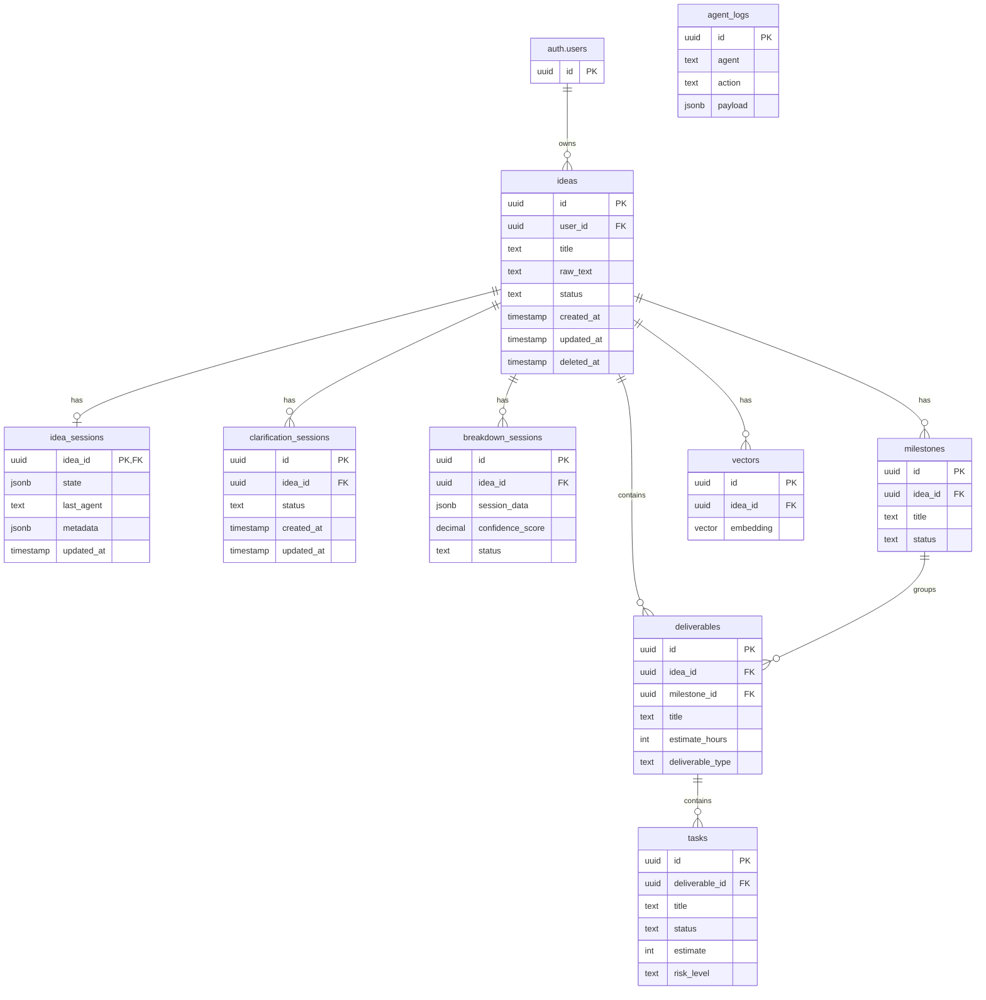

# Database Schema Documentation

## Entity Relationship Diagram (ERD)



This document provides comprehensive documentation for the IdeaFlow database schema, including tables, relationships, indexes, and Row Level Security (RLS) policies.

## Overview

The IdeaFlow database uses PostgreSQL with Supabase. The schema consists of 15+ tables that manage ideas, tasks, deliverables, agent interactions, and more.
## Table Relationships

```
ideas (1) ────> idea_sessions (1)
     │
     │ (1:N)
     ▼
milestones (1) <───> deliverables (N:1)
                           │
                           │ (1:N)
                           ▼
                      tasks (N)
                           │
         ┌──────────────────┼──────────────────┐
         │                  │                  │
         ▼                  ▼                  ▼
  task_dependencies  task_assignments  time_tracking
```

## Core Tables

### ideas

The central table storing all user ideas.

| Column | Type | Constraints | Description |
|--------|------|------------|-------------|
| `id` | UUID | PRIMARY KEY | Unique identifier |
| `user_id` | UUID | REFERENCES auth.users(id) | Owner of the idea |
| `title` | TEXT | NOT NULL | Idea title |
| `raw_text` | TEXT | NOT NULL | Original idea description |
| `created_at` | TIMESTAMP | DEFAULT NOW() | Creation timestamp |
| `updated_at` | TIMESTAMP | DEFAULT NOW() | Last update timestamp |
| `status` | TEXT | CHECK | Status: draft, clarified, breakdown, completed |
| `deleted_at` | TIMESTAMP | NULL | Soft delete timestamp |

**Indexes:**
- Primary key on `id`
- Index on `user_id`
- Index on `status`
- Composite index on `(user_id, status)`

**RLS:** Users can only access their own ideas

---

### idea_sessions

Stores session data for idea processing.

| Column | Type | Constraints | Description |
|--------|------|------------|-------------|
| `idea_id` | UUID | PRIMARY KEY, FK → ideas | Reference to idea |
| `state` | JSONB | NULL | Session state data |
| `last_agent` | TEXT | NULL | Last agent that processed |
| `metadata` | JSONB | NULL | Additional metadata |
| `updated_at` | TIMESTAMP | DEFAULT NOW() | Last update |

**RLS:** Linked to ideas access control

---

### deliverables

High-level deliverables/tasks groups within ideas.

| Column | Type | Constraints | Description |
|--------|------|------------|-------------|
| `id` | UUID | PRIMARY KEY | Unique identifier |
| `idea_id` | UUID | FK → ideas | Parent idea |
| `title` | TEXT | NOT NULL | Deliverable title |
| `description` | TEXT | NULL | Detailed description |
| `priority` | INTEGER | DEFAULT 0 | Priority order |
| `estimate_hours` | INTEGER | DEFAULT 0 | Estimated hours |
| `completion_percentage` | INTEGER | CHECK 0-100 | Progress |
| `deliverable_type` | TEXT | CHECK | feature, documentation, testing, deployment, research |

**Indexes:**
- Composite index on `(idea_id, priority)`

**RLS:** Users can only access their own deliverables

---

### tasks

Individual tasks within deliverables.

| Column | Type | Constraints | Description |
|--------|------|------------|-------------|
| `id` | UUID | PRIMARY KEY | Unique identifier |
| `deliverable_id` | UUID | FK → deliverables | Parent deliverable |
| `title` | TEXT | NOT NULL | Task title |
| `status` | TEXT | CHECK | todo, in_progress, completed |
| `assignee` | TEXT | NULL | Assigned person |
| `estimate` | INTEGER | DEFAULT 0 | Estimated hours |
| `priority_score` | DECIMAL(5,2) | CHECK >=0 | Priority score |
| `complexity_score` | INTEGER | CHECK 1-10 | Complexity rating |
| `risk_level` | TEXT | CHECK | low, medium, high |
| `tags` | TEXT[] | NULL | Task tags |

**Indexes:**
- Composite index on `(deliverable_id, status)`
- Index on `(status, priority_score)`

**RLS:** Users can only access tasks in their deliverables

---

### task_dependencies

Manages task dependency relationships.

| Column | Type | Constraints | Description |
|--------|------|------------|-------------|
| `predecessor_task_id` | UUID | FK → tasks | Task that must complete first |
| `successor_task_id` | UUID | FK → tasks | Dependent task |
| `dependency_type` | TEXT | CHECK | finish_to_start, start_to_start, finish_to_finish |

**Constraints:**
- UNIQUE on `(predecessor_task_id, successor_task_id)`

---

### breakdown_sessions

Tracks AI breakdown processing sessions.

| Column | Type | Constraints | Description |
|--------|------|------------|-------------|
| `id` | UUID | PRIMARY KEY | Unique identifier |
| `idea_id` | UUID | FK → ideas | Processed idea |
| `session_data` | JSONB | NOT NULL | Breakdown data |
| `ai_model_version` | TEXT | NULL | AI model used |
| `confidence_score` | DECIMAL(3,2) | CHECK 0-1 | Confidence level |
| `status` | TEXT | CHECK | analyzing, decomposing, scheduling, completed, failed |

---

### risk_assessments

Risk tracking for tasks/deliverables.

| Column | Type | Constraints | Description |
|--------|------|------------|-------------|
| `id` | UUID | PRIMARY KEY | Unique identifier |
| `idea_id` | UUID | FK → ideas | Related idea |
| `task_id` | UUID | FK → tasks | Associated task |
| `risk_factor` | TEXT | NOT NULL | Risk description |
| `impact_level` | TEXT | CHECK | very_low, low, medium, high, very_high |
| `risk_score` | DECIMAL(5,2) | CHECK 0-100 | Calculated risk score |
| `status` | TEXT | CHECK | open, mitigated, accepted, closed |

**Indexes:**
- Index on `(status, risk_score)`

---

### agent_logs

Audit log for AI agent actions.

| Column | Type | Constraints | Description |
|--------|------|------------|-------------|
| `id` | UUID | PRIMARY KEY | Unique identifier |
| `agent` | TEXT | NOT NULL | Agent name |
| `action` | TEXT | NOT NULL | Action performed |
| `payload` | JSONB | NULL | Action details |
| `timestamp` | TIMESTAMP | DEFAULT NOW() | Action timestamp |

**Indexes:**
- Index on `agent`
- Composite index on `(agent, action)`

**Note:** Agent logs are restricted to service_role only for security.

---

## Row Level Security (RLS)

All tables have RLS enabled with the following patterns:

### Access Patterns

1. **User-owned data**: Users can only access their own data (ideas, deliverables, tasks)
2. **Linked access**: Users can access data linked to their ideas
3. **Service role**: Bypass for administrative operations

### RLS Policies Summary

| Table | SELECT | INSERT | UPDATE | DELETE |
|-------|--------|--------|--------|--------|
| ideas | Owner only | Owner only | Owner only | Owner only |
| deliverables | Via ideas | Via ideas | Via ideas | Via ideas |
| tasks | Via deliverables | Via deliverables | Via deliverables | Via deliverables |
| agent_logs | service_role only | service_role only | service_role only | service_role only |

---

## Related Documentation

- [API Reference](./api.md) - API endpoints for data operations
- [Architecture](./architecture.md) - System design overview
- [Environment Setup](./environment-setup.md) - Database initialization